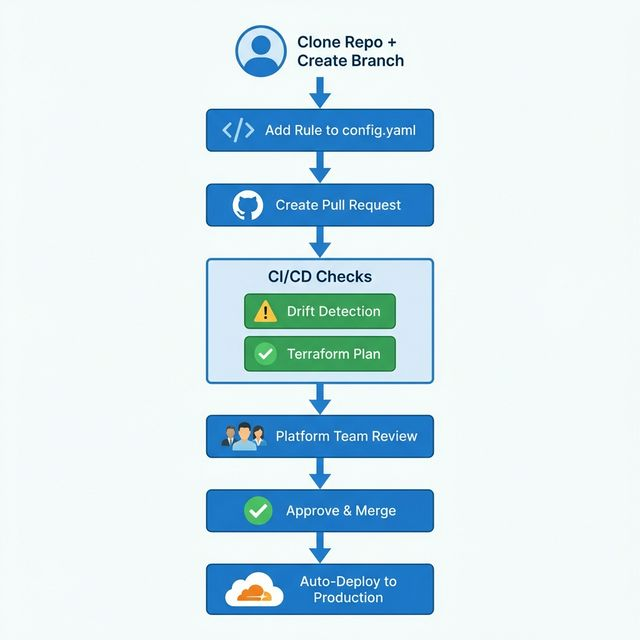

# Simplified Production Workflow - Summary

## 🎯 The Simple Flow



## ✅ What Happens on Pull Request

### 1. Drift Check (Automatic - Blocks PR)
```
✅ Checks if manual changes exist in Cloudflare
❌ Blocks PR if drift detected
📝 Posts comment with import commands
```

### 2. Terraform Plan (Automatic - Shows Changes)
```
✅ Runs terraform plan
📝 Posts plan output to PR
✅ Shows exactly what will change
```

## ✅ What Happens After Merge

### Automatic Apply to Production
```
✅ Merge to main triggers automatic apply
✅ Changes pushed to Cloudflare Production
✅ No manual intervention needed
```

## 🚫 PR is Blocked If:

- ❌ **Drift detected** - Manual changes in Cloudflare
- ❌ **Plan fails** - Invalid configuration
- ❌ **Validation fails** - Invalid IP, mode, etc.

## 📋 User Checklist

```
1. Clone repo
2. Create branch: git checkout -b block-ip-x.x.x.x
3. Edit shared/config.yaml (add your rule)
4. Commit and push
5. Create Pull Request
6. Wait for CI checks (green ✅)
7. Wait for Platform Team approval
8. Merge
9. Done! (automatic apply to Cloudflare)
```

## 🎓 Key Points

- **No manual terraform apply** - Everything automated
- **Drift detection built-in** - Prevents manual changes
- **Code review required** - Platform team approves
- **Automatic deployment** - Merge = Deploy
- **Safe** - Plan shown before apply

## 🔧 Setup Required (One-Time)

1. **GitHub Secrets**: Add `CLOUDFLARE_API_TOKEN`
2. **Branch Protection**: 
   - Require pull request reviews
   - Require status checks to pass
3. **Team Training**: Share this document

---

**That's it! Simple, safe, and automated.** 🎉
